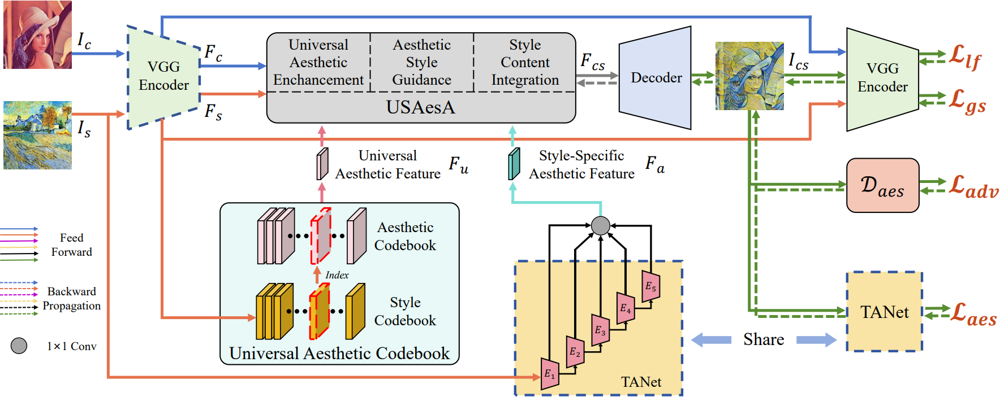

# AesStyler: Aesthetic Guided Universal Style Transfer (ACM MM 2024)

## Abstract
> Recent studies have shown impressive progress in universal style
transfer which can integrate arbitrary styles into content images.
However, existing approaches struggle with low aesthetics and
disharmonious patterns in the final results. To address this problem,
we propose AesStyler, a novel Aesthetic Guided Universal Style
Transfer method. Specifically, our approach introduces the aesthetic
assessment model, trained on a dataset with human-assessed aes-
thetic scores, into the universal style transfer task to accurately
capture aesthetic features that universally resonate with human
aesthetic preferences. Unlike previous methods which only consider
aesthetics of specific style images, we propose to build a Universal
Aesthetic Codebook (UAC) to harness universal aesthetic features
that encapsulate the global aspects of aesthetics. Aesthetic features
are fed into a novel Universal and Style-specific Aesthetic-Guided
Attention (USAesA) module to guide the style transfer process.
USAesA empowers our model to integrate the aesthetic attributes
of both universal and style-specific aesthetic features with style
features and facilitates the fusion of these aesthetically enhanced
style features with content features. Extensive experiments and
user studies have demonstrated that our approach generates aes-
thetically more harmonious and pleasing results than the state-of-
the-art methods, both aesthetic-free and aesthetic-aware.

## Code
The code will be open-sourced after publication.